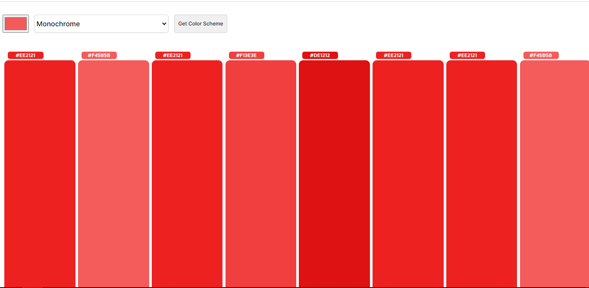

# Hacktoberfest 2022 - JavaScript Easy Programs

## Color-Pallete-Generator -Your fast, modern, swiss army knife for color.

### Problem Statement
Create a Color-Pallete-Generator using the color api: (https://www.thecolorapi.com/)

### Description
Color-Pallete-Generator uses the the color api endpoints and resources to retrieve the
multiple shades of same color and different color, th purpose of making this website, is that developers always looks for good contrasting color that appease the eyes!

### Input Format
Users can select their color e.g: Monochrome,Complement,Analogic and so on, once the user has selected their type of color they want, they just need to click the color scheme button!

### Image Example

### Contributor
[Geekky Coder](https://github.com/GeekkyCoder)