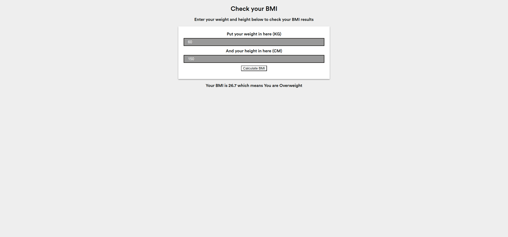

# Hacktoberfest 2022 - JavaScript Easy Programs

## BMI Calculator

### Problem Statement

Create a BMI calculator that can perform basic BMI Calculation.

### Input Format

The input will be provided by the user (height and weight)

### Output Format

The output will be displayed with some observation.

### Image

### Maintainer

- [Anamaya](https://www.linkedin.com/in/anamaya1729/)
- [Vaibhav](https://https://www.linkedin.com/in/vaibhava17/)

### License

**This project is licensed under the GNU GENERAL PUBLIC License - see the [LICENSE](../LICENSE) file for details**

### Happy Coding! :smile:
