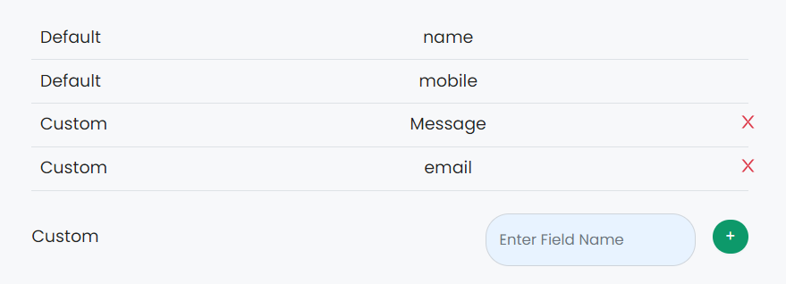

# Hacktoberfest 2022 - JavaScript Easy Programs

## Custom Field Form 

### Problem Statement
Create a form that allows user to add dynamic field to form using Add Field Buttons and display all the values on a page of all the fields when submit.

### Description
The Form should have two default fields 
1. Name
2. Number
The Form should have button to add additional fields to the form. The form should have buttons at the end of dynamically added field for deletion.
Validation are for empty field is reqired. On Submit form must display its values below in any order.

### Input Format
Field Name will be provided by user to add a field. 

### Output Format
The output will be displayed below the form.

### Sample Input

### Sample Output

```

### Image Example

<br>It is just an example. You can use any design you want.


### Maintainer
- [Anamaya](https://www.linkedin.com/in/anamaya1729/)
- [Vaibhav](https://https://www.linkedin.com/in/vaibhava17/)

### License
**This project is licensed under the GNU GENERAL PUBLIC License - see the [LICENSE](../LICENSE) file for details**

### Happy Coding! :smile: