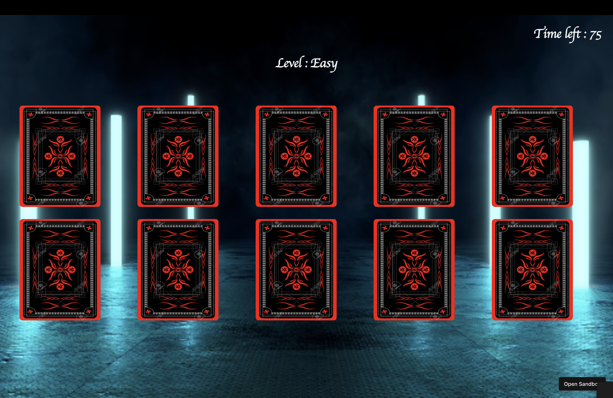

# Card Memory Game

## Medium level

 

## Tech Used - HTML CSS JS
 

## Game Description

The game Memory Trigger is a simple Card Game where there will be 10 cards of types(King,Queen,Joker,Spade & Heart) 2 of each displayed in the screen in random order. They are hidden initially.

The user should select 2 cards randomly and the card would be shown to user. If they match then a pair is found and both cards would be removed.

Else both the cards would be again hidden and the user has to keep in mind what was that card type in making future gueses

Thus this increases the memory power and ability to remind and keep track of card position

The game has a countdown and difficulty level is set accordingly
- EASY (60 secs)
- MEDIUM (45 secs)
- HARD (30 secs)
- EXTREME (20 secs)

## How the game is developed?

It's done using simple HTML CSS and JS
Initially there are 10 cards kept as HTML elements
A random sequence of card type is generated every time a new game is started. Based on the sequence the image corresponding to the card type would be projected to the user.

If the selected two cards i.e HTML elements src attribute is same then the selected cards matches and both of them are removed using DOM queries.

If it doesn't match the cards are again hidden

If all the 10 elements are removed within the time then the game is completed and the user has won the game and he can progress to the next level

## Sample Pictures

  

  

  

  

  

  

## Demo Video Below

