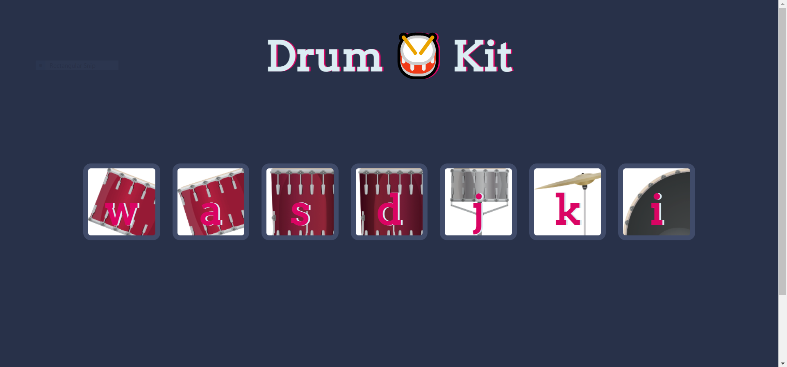

# Drum-Kit

Created using HTML5, CSS3 and JavaScript.

## Feature

- You can play any musical instruments by just clicking on image of instruments and also by typing the alphabet which is written on the musical instruments.
- You can also use this in your mobile phones to play instruments, we can simply call it an online mini band 🥁🎸🎺, which will be just one click away from you.
- The sounds of the musical instruments are realistic and astonishing.

## Preview

### Maintainer

- [Anamaya](https://www.linkedin.com/in/anamaya1729/)
- [Vaibhav](https://https://www.linkedin.com/in/vaibhava17/)

### License

**This project is licensed under the GNU GENERAL PUBLIC License - see the [LICENSE](../LICENSE) file for details**

### Happy Coding! :smile:
